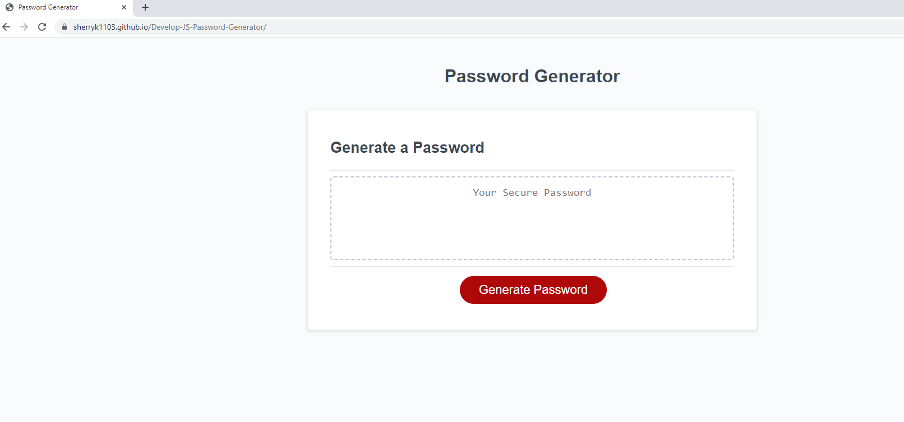

# Develop-JS-Password-Generator

## Description

I wanted to create a web application that generates a unique password for security purposes. With so many web applications requiring unique and pecific passwords, it is imperative, again for security, to create a unique password that meets each web application's (whether it be a bank, social media, or a healthcare related application) criteria.

## Installation

To install code, run the following command:
Git clone <paste SSH key>

## Deployed Link

https://sherryk1103.github.io/Develop-JS-Password-Generator/

## Usage

## Process Steps

1. Created a unique GitHub repo for this project.
2. Declared variables to reflect the password criteria i.e. upper and lowercase, special characters, numbers, etc with the confirm function so that the user could select the OK button or Cancel button.
3. Created conditional/if statements to aide in the concatination of the password.
4. Added a for loop so that it would repeat the steps as many times to match how many characters the user selected
5. Added the getRandomInt function to generate numbers randomly in the for loop
